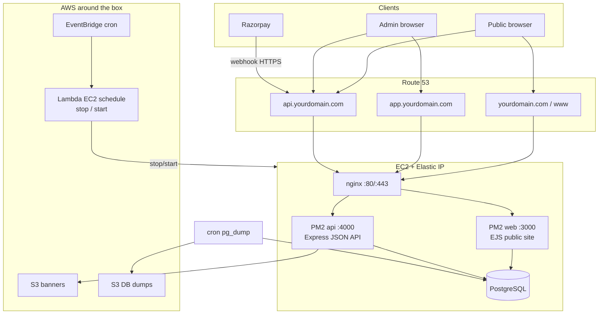

# TicketBox architecture (Week 2)

## Request paths

| URL | nginx | Upstream |
|---|---|---|
| `https://yourdomain.com` | `ticketbox-web` | `127.0.0.1:3000` (EJS reads Postgres directly) |
| `https://api.yourdomain.com` | `ticketbox-api` | `127.0.0.1:4000` |
| `https://app.yourdomain.com` | static `/var/www/admin` | Vite `dist/` |

Admin SPA and public checkout call the API via `VITE_API_URL` / `API_PUBLIC_URL`. CORS allows `WEB_ORIGIN` / `ADMIN_ORIGIN`.

## Money / safety controls (Day 10)

- EventBridge → Lambda stops EC2 overnight; Elastic IP keeps DNS stable
- Nightly `pg_dump` to local disk + optional S3 backup bucket
- Security group: 22 (restricted) / 80 / 443 only — never public 3000/4000
